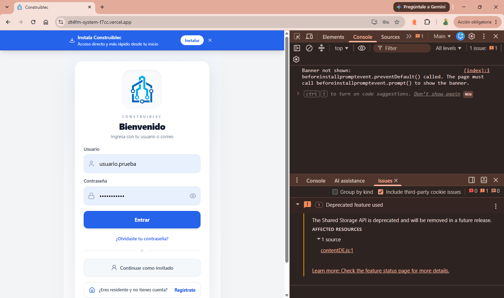
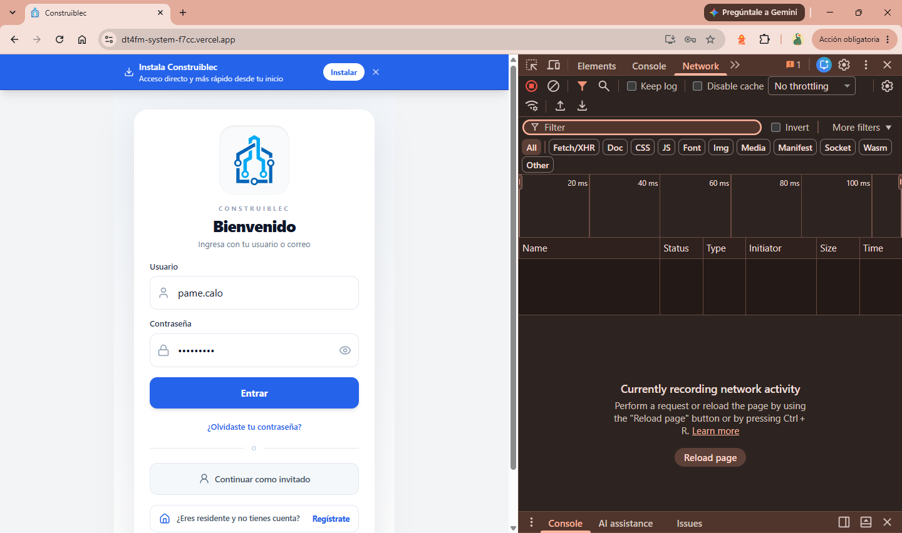
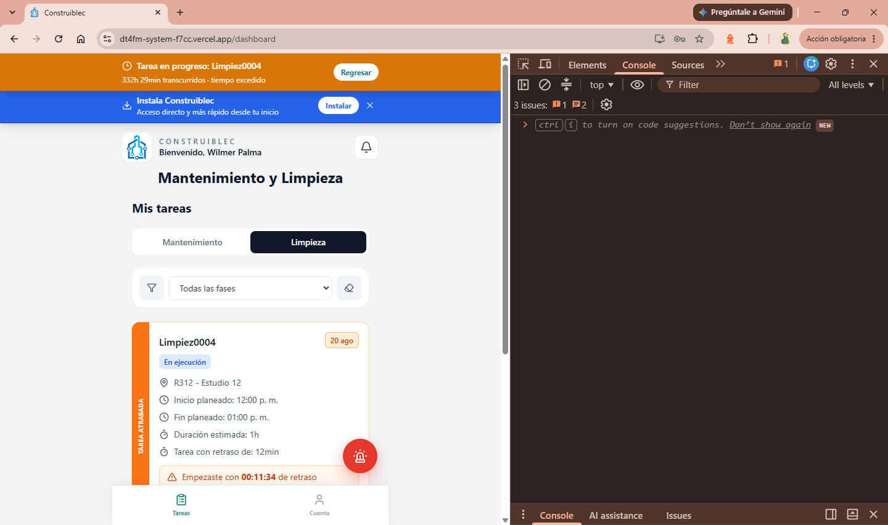

# Fase 1 — Pruebas técnicas internas (Piloto GDGI)

Checklist de infraestructura

**Cómo se documenta:**
- Completar `Resultado obtenido` y `Estado` directamente en esta tabla.
- `Estado`: `OK` / `FALLA` / `PENDIENTE`.
- Si el comando devuelve algo largo (logs, JSON), pegarlo en el bloque `Evidencia` debajo de la fila, no en la celda.
- **Nunca pegar contraseñas ni secretos reales aquí.** Usar el nombre de la variable de entorno (`OPENMAINT_PASSWORD`, etc.), no el valor.
- Un commit al cerrar la fase completa alcanza; no hace falta un commit por prueba.

**Valores a reemplazar antes de empezar** (no se guardan en este archivo):
- `<IP_VPS>` / `<SSH_USER>` — acceso al VPS Hostinger
- `<OPENMAINT_URL>` — de la variable `OPENMAINT_URL` en Render (ej. `http://<ip>:8090/cmdbuild/services/rest/v3`)
- `<OPENMAINT_TEST_USER>` / `<OPENMAINT_TEST_PASS>` — un usuario de prueba, no el admin
- `<BACKEND_URL>` — URL pública del servicio en Render
- `<FRONTEND_URL>` — URL pública en Vercel

---

## Resultados

Ejecutado el 2026-09-03 sobre `4f012187` (tip de `main`, producción).

| ID | Componente | Resultado esperado | Resultado obtenido | Estado |
|---|---|---|---|---|
| INF-01 | Acceso al VPS Hostinger | Conexión OK; contenedores arriba; RAM/disco con margen frente a los `mem_limit` del compose (~29 GB sumados) | SSH OK. 5 contenedores `Up`, solo `openmaint-db` reporta `Up (healthy)`. Disco 24% (297 GB libres). RAM: 31 GiB totales, 25 GiB en uso, **5,2 GiB disponibles, swap 0 B**. Uptime 22 días, load 0,70 | OK — ver H-2, H-6 |
| INF-02 | Disponibilidad de OpenMaint | 200 con `data._id` (sessionId) | 200 con `data._id`. Ejecutado con la cuenta `admin` (`admin_all: true`), no con un usuario de prueba | OK — ver H-10 |
| INF-03a | Acceso a Postgres del backend (Neon) | Migraciones aplicadas, ninguna pendiente | `[X]` en las 2 migraciones; ninguna pendiente | OK — ver H-8 |
| INF-03b | Acceso a Postgres de openMAINT (VPS, `openmaint-db`) | `pg_isready` OK; `openmaint_3` tiene tablas | `accepting connections`; `openmaint_3` con tablas (el `head` solo alcanzó el esquema `gis`) | OK |
| INF-04 | Disponibilidad del Backend (Render) | `{"status":"ok","commit":"<sha>"}`, `commit` no nulo | `commit: 4f012187…` = tip exacto de `origin/main`. Producción al día con su rama | OK — ver H-5 |
| INF-05 | Disponibilidad del Frontend (Vercel) | Carga completa, sin errores de consola, certificado válido | Carga completa sobre HTTPS. Sin errores de la app: el único *issue* de consola proviene de `contentDE.js` (extensión del navegador, no del código). Dominio `dt4fm-system-f7cc.vercel.app` | OK — ver H-7 |
| INF-06 | Comunicación Frontend → Backend | Login real responde 200, sin bloqueo de CORS | Login 201 + 3 XHR 200 (`unread-count`, `my`, `mine`). Sin errores de CORS. Login tardó 2,45 s; 4 preflights 204 de 353-480 ms cada uno | OK — ver H-3, H-4, H-12 |
| INF-07 | Comunicación Backend → OpenMaint | 200 con `sessionId`, `role`, `availableRoles`; sin reintentos en logs | 200 con `sessionId`, `role: MaintOffice`, `availableRoles`, `employeeId`, `cleaningEmployeeId`. Logs de Render: sesión de servicio 200 + 2 lecturas de `Employee/cards` 200, sin reintentos | OK — ver H-1 |

**Resultado de la fase: 8/8 sin fallas funcionales.** La cadena completa (VPS → openMAINT → backend → frontend) responde. Los hallazgos de abajo no son fallas de estas pruebas: son riesgos que la fase dejó a la vista.

**Fuera de alcance por ahora:** Alfresco (adjuntos), BIMserver, GeoServer — se agregan si el piloto termina usando esos módulos.

---

## Hallazgos

Clasificados con la escala del procedimiento (P1 crítico → P4 bajo).

### H-1 · P2 · El tráfico backend → openMAINT va en HTTP plano por internet
Los logs de Render muestran una llamada `POST` en claro contra el puerto `8090` del VPS (IP visible en `image-4.png`). Las credenciales del servicio (`OPENMAINT_USERNAME` / `OPENMAINT_PASSWORD`) cruzan internet en texto claro en cada login, y el compose publica `8090` en todas las interfaces, así que la interfaz administrativa de openMAINT también queda expuesta sin TLS. Contradice directamente "HTTPS en todos los accesos externos" (Fase 5 / TS-008).
**Corrección:** proxy inverso con TLS (Caddy o nginx + Let's Encrypt) delante de `openmaint-app`, y cerrar 8090 al público.
**Nota:** la IP real del VPS queda visible en `image-4.png` (captura de los logs de Render) — evaluar si ese archivo debe ir a un repositorio privado o recortarse antes de subirlo.

### H-2 · P2 · El VPS no tiene margen de memoria ni swap
31 GiB totales, 25 GiB en uso, **5,2 GiB disponibles y swap en 0**. Los `mem_limit` del compose suman ~29 GiB, y solo los techos de heap de las JVM (`-Xmx9g` de `openmaint-app` + `-Xmx10g` de `bimserver`, más Alfresco y GeoServer) ya exceden la RAM física. Sin swap no hay degradación gradual: el OOM killer mata un contenedor. Es el escenario que TI-004 y TR-006 dan por hipotético.
**Corrección barata e inmediata:** si el piloto no usa BIM ni GIS, detener `openmaint-bimserver` y `geoserver` libera los dos heaps más grandes. **No** detener Alfresco sin confirmar antes que ningún módulo suba adjuntos.

### H-3 · P3 · Cada petición paga un preflight CORS de ~400 ms
En INF-06 se ven 4 preflights `204` (353 ms el del login; 479-480 ms los de `unread-count`, `my` y `mine`). El middleware de [main.ts](../../backend/src/main.ts#L10-L27) no envía `Access-Control-Max-Age`, así que el navegador no puede cachear la respuesta y repite el preflight en cada petición. El login completo tardó 2,45 s.
**Corrección:** una línea de cabecera. Conviene hacerlo antes de medir la línea base de Fase 6, o la baseline queda inflada.

### H-4 · P3 · CORS refleja cualquier Origin con credenciales
Ya estaba identificado en el procedimiento (TS-002) y queda confirmado en producción. [main.ts:10-12](../../backend/src/main.ts#L10-L12) devuelve el `Origin` recibido junto a `Access-Control-Allow-Credentials: true`. Se corrige junto con H-3, que toca el mismo middleware.

### H-5 · P3 · La versión en producción no incluye el fix de sesión en endpoints de propietarios
Producción sirve `4f01218`, que es correctamente el tip de `main`. Pero `develop` va 3 commits adelante, y uno es `cd385c1 fix(owners): exigir sesion en endpoints de propietarios`. Congelar RC1 sobre `main` tal como está significa certificar una versión con un defecto que ya está corregido: TS-003 y TS-004 fallarían por algo resuelto.
**Decisión de Fase 0:** mergear `develop` → `main` y tagear RC1 sobre el resultado.

### H-6 · P4 · Solo `openmaint-db` tiene healthcheck
Los otros cuatro contenedores informan `Up`, que significa "el proceso vive", no "la aplicación responde". `openmaint-app` podría estar `Up` con Tomcat sin servir y el checklist lo leería como sano. Añadir un healthcheck HTTP a `openmaint-app`.

### H-7 · P4 · El frontend se sirve desde un subdominio autogenerado de Vercel
`dt4fm-system-f7cc.vercel.app`. Para un cliente real conviene un dominio propio, y hacerlo *antes* del piloto evita rehacer después la lista de orígenes de CORS y lidiar con la caché del service worker de la PWA (relacionado con TR-004).

### H-8 · P4 · Aviso de TLS del driver `pg`
`sslmode=require` se trata hoy como `verify-full`, pero en pg v9 adoptará la semántica de libpq, más débil. Fijar `sslmode=verify-full` explícito en las cadenas de Neon antes de esa actualización, o la verificación de certificado se debilita en silencio.

### H-9 · P4 · El reloj del host no coincide con el de los contenedores
`uptime` marcó 20:34 mientras openMAINT registraba `beginDate 13:19Z` (08:19 en Guayaquil): el host va ~12 h adelante, mientras los contenedores fuerzan `TZ=America/Guayaquil`. Los timestamps de la aplicación son correctos, pero los del host (`docker logs`, cron, respaldos) no correlacionan con ellos. Confirmar con `timedatectl`. Importa para TD-003.

### H-10 · Higiene del documento · sessionIds reales y uso de la cuenta admin
**Resuelto en este documento:** los dos sessionIds reales (uno de `admin`, otro de `wilmer.palma`) ya se reemplazaron por `<sessionId>` en la sección Evidencia. Sigue pendiente que **INF-02 se corrió con la cuenta administradora** en vez de un usuario de prueba dedicado — no es un problema de redacción, es que la prueba no valida lo que dice validar (acceso de un usuario normal). Repetir con `<OPENMAINT_TEST_USER>` real antes de dar la fase por cerrada.

### H-11 · RF / calidad de datos · Residuos de prueba en producción
El dashboard muestra `Limpiez0004` "en ejecución" con 332 h transcurridas (desde el 20 de agosto) y el cartel "tiempo excedido". Antes de que el cliente empiece a operar hay que cerrar o limpiar estos residuos (Fase 8, validación de la carga inicial).

### H-12 · Evidencia · INF-06 mezcla dos sesiones distintas
La captura del formulario muestra `pame.calo`, pero el dashboard resultante corresponde a Wilmer Palma. Todo indica que son capturas de dos intentos distintos, no un cruce de identidades, pero tal como está la evidencia no lo demuestra. Recapturar INF-06 con una sola sesión de principio a fin.

---

## Evidencia

### INF-01
```bash
$ ssh <SSH_USER>@<IP_VPS>
$ docker-compose ps 
       Name                      Command                  State                                     Ports                               
----------------------------------------------------------------------------------------------------------------------------------------
alfresco              /bin/sh -c /usr/bin/superv ...   Up             137/tcp, 138/tcp, 139/tcp, 21/tcp, 445/tcp, 7070/tcp, 8009/tcp,   
                                                                      0.0.0.0:8085->8080/tcp,:::8085->8080/tcp                          
geoserver             /bin/bash /scripts/entrypo ...   Up             0.0.0.0:8092->8080/tcp,:::8092->8080/tcp, 8443/tcp                
openmaint-app         /bin/sh -c /usr/local/bin/ ...   Up             0.0.0.0:8090->8080/tcp,:::8090->8080/tcp                          
openmaint-bimserver   /bin/sh -c catalina.sh run       Up             0.0.0.0:8094->8080/tcp,:::8094->8080/tcp                          
openmaint-db          docker-entrypoint.sh postg ...   Up (healthy)   127.0.0.1:5432->5432/tcp          

$ df -h
Filesystem      Size  Used Avail Use% Mounted on
tmpfs           3.2G  2.0M  3.2G   1% /run
/dev/sda1       388G   91G  297G  24% /
tmpfs            16G     0   16G   0% /dev/shm
tmpfs           5.0M     0  5.0M   0% /run/lock
/dev/sda15      105M  6.1M   99M   6% /boot/efi
overlay         388G   91G  297G  24% /var/lib/docker/overlay2/b6ee834e90e9fa4a3bcd84b226451ca0b85f3c4d46384adda9ca2a8d138d05ca/merged
overlay         388G   91G  297G  24% /var/lib/docker/overlay2/518c7728971543f70bc2774aee659cb7559884788d39c3ff14f54df934169d12/merged
overlay         388G   91G  297G  24% /var/lib/docker/overlay2/db9afd1d129cecc52d09899a04677991bcb0503878607cccec2dde9469745774/merged
overlay         388G   91G  297G  24% /var/lib/docker/overlay2/d479f73220f6f8612c60d1080ac3fbb4f73d19c12b7aaec80ea78e8fe29f820d/merged
overlay         388G   91G  297G  24% /var/lib/docker/overlay2/2bca37b26c4b1dbc9a8747ffc9d7e08cc3e4a1252c73880e4cfc84b67c4fe8d0/merged
overlay         388G   91G  297G  24% /var/lib/docker/overlay2/c591dfbf2a3e0bc2ab542694056b592601560e03fefd9a8ae51a1e5e024f8c66/merged
overlay         388G   91G  297G  24% /var/lib/docker/overlay2/144d6c53293bf1c74104f385561f9a822386c64ef406909f33ab1c328d343d89/merged
tmpfs           3.2G  4.0K  3.2G   1% /run/user/0
overlay         388G   91G  297G  24% /var/lib/docker/overlay2/062fd6989f58183f4ce5cff7ab250ad52839dd3a1f045303d8eec665cc4f9405/merged
overlay         388G   91G  297G  24% /var/lib/docker/overlay2/ea10715a2cc490a35bb6982a50630dc5a27ffad3bd59350c546f81de215a3a36/merged

$ free -h
               total        used        free      shared  buff/cache   available
Mem:            31Gi        25Gi       548Mi       338Mi       5.5Gi       5.2Gi
Swap:             0B          0B          0B

$ uptime
20:34:36 up 22 days,  7:17,  4 users,  load average: 0.70, 0.43, 0.33
```

### INF-02
```bash
$ curl -X POST "<OPENMAINT_URL>/sessions?scope=service&returnId=true" \
  -H "Content-Type: application/json" \
  -d '{"username":"<OPENMAINT_TEST_USER>","password":"<OPENMAINT_TEST_PASS>"}'
{"success":true,"data":{"_id":"<sessionId>","username":"admin","userId":189802,"userDescription":"Administrator","role":"SuperUser","availableRoles":["SuperUser"],"multigroup":false,"rolePrivileges":{"admin_all":true, "...": "(recortado — 104 privilegios, todos true: cuenta admin)"},"beginDate":"2026-09-03T13:19:10.174015813Z","lastActive":"2026-09-03T13:19:10.174015813Z","device":"default","sessionType":"batch"}}
```
**Redactado:** `_id` (sessionId real) reemplazado por `<sessionId>`; `rolePrivileges` recortado (era el volcado completo de 104 permisos). Ver H-10.

### INF-03a
```bash
# con DATABASE_URL_DIRECT de producción exportado
$ npm run migration:show:prod
> backend@0.0.1 migration:show:prod
> typeorm migration:show -d dist/database/data-source.js

(node:74404) Warning: SECURITY WARNING: The SSL modes 'prefer', 'require', and 'verify-ca' are treated as aliases for 'verify-full'.
In the next major version (pg-connection-string v3.0.0 and pg v9.0.0), these modes will adopt standard libpq semantics, which have weaker security guarantees.

To prepare for this change:
- If you want the current behavior, explicitly use 'sslmode=verify-full'
- If you want libpq compatibility now, use 'uselibpqcompat=true&sslmode=require'

See https://www.postgresql.org/docs/current/libpq-ssl.html for libpq SSL mode definitions.
(Use `node --trace-warnings ...` to show where the warning was created)
[X] 1 CreatePushNotificationTables1787588739437
[X] 2 PushSubscriptionMultipleRoles1787600000000
```

### INF-03b
```bash
# ya conectado por SSH al VPS
$ docker exec -it openmaint-db pg_isready -U postgres
/var/run/postgresql:5432 - accepting connections

$ docker exec -it openmaint-db psql -U postgres -d openmaint_3 -c "\dt" | head
                      List of relations
 Schema |               Name               | Type  |  Owner   
--------+----------------------------------+-------+----------
 gis    | Gis_Building_Position            | table | cmdbuild
 gis    | Gis_Computer_Position            | table | cmdbuild
 gis    | Gis_FireExtinguisher_Position    | table | cmdbuild
 gis    | Gis_GreenArea_Area               | table | cmdbuild
 gis    | Gis_Meter_Position               | table | cmdbuild
 gis    | Gis_ParkingLot_Area              | table | cmdbuild
 gis    | Gis_Room_Area                    | table | cmdbuild
```

### INF-04
```bash
$ curl <BACKEND_URL>/health
{"status":"ok","timestamp":"2026-09-03T13:24:40.717Z","commit":"4f012187cdf42d99eab5f6e6625b3453212c05f7"}
```

### INF-05
Abrir `<FRONTEND_URL>` en el navegador. Revisar consola (F12) sin errores rojos.


### INF-06
Login real desde la app, con DevTools → Network abierto. Revisar que la llamada a `/auth/login` responde 200 y no aparece error de CORS en consola.




### INF-07
```bash
$ curl -X POST <BACKEND_URL>/auth/login \
  -H "Content-Type: application/json" \
  -d '{"username":"<OPENMAINT_TEST_USER>","password":"<OPENMAINT_TEST_PASS>"}'
{"sessionId":"<sessionId>","username":"wilmer.palma","userId":628914,"role":"MaintOffice","availableRoles":["MaintOffice"],"roleLabels":{"...": "(recortado)"},"name":"Mantenimiento y limpieza CP y LP","employeeId":1558676,"cleaningEmployeeId":1558676,"tenantId":null}
```
**Redactado:** `sessionId` real reemplazado por `<sessionId>`; `roleLabels` recortado (catálogo estático de 11 roles, sin dato de la prueba). Ver H-10.

En simultáneo, se revisó los logs del servicio en el dashboard de Render.
