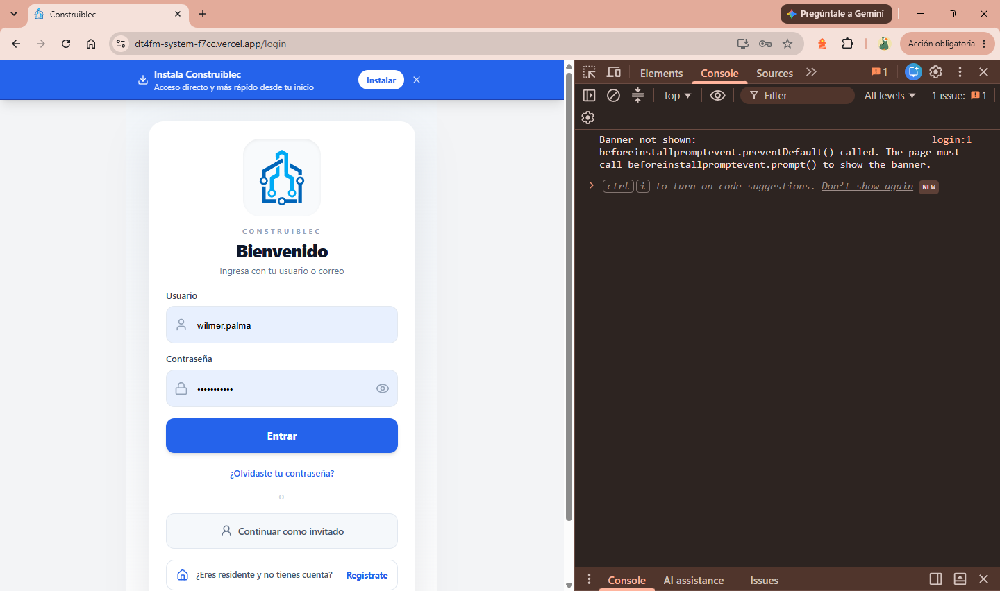
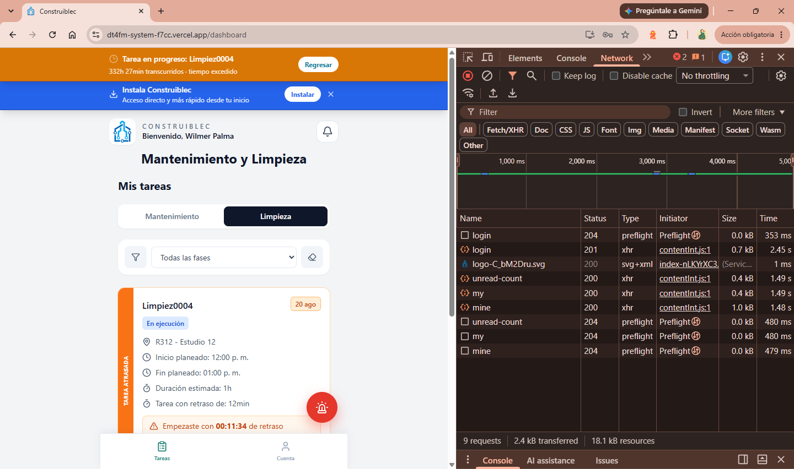
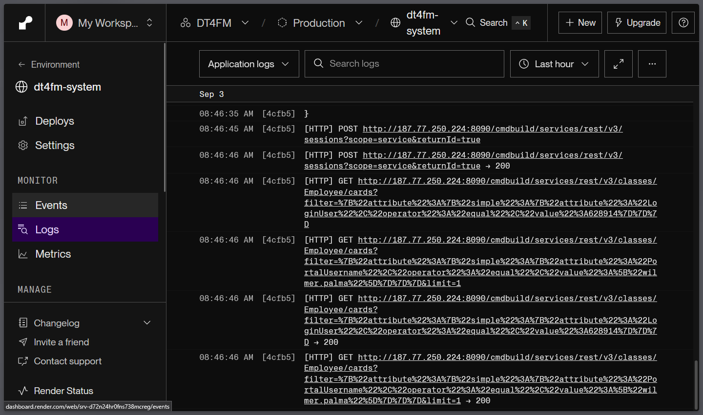

# Fase 1 — Pruebas técnicas internas (Piloto GDGI)

Checklist de infraestructura. Los casos se numeran `INF-xx` (**INF** = infraestructura).

## Resultados

Ejecutado el 2026-09-03 sobre `4f012187` (tip de `main`, producción).

| ID | Componente | Resultado esperado | Resultado obtenido | Estado |
|---|---|---|---|---|
| INF-01 | Acceso al VPS Hostinger | Conexión OK; contenedores arriba; RAM/disco con margen frente a los `mem_limit` del compose (~29 GB sumados) | SSH OK. 5 contenedores `Up`, solo `openmaint-db` reporta `Up (healthy)`. Disco 24% (297 GB libres). RAM: 31 GiB totales, 25 GiB en uso, **5,2 GiB disponibles, swap 0 B**. Uptime 22 días, load 0,70 | OK — ver H-2, H-6 |
| INF-02 | Disponibilidad de OpenMaint | 200 con `data._id` (sessionId) | 200 con `data._id`, `role: MaintOffice`, con `wilmer.palma` | OK |
| INF-03a | Acceso a Postgres del backend (Neon) | Migraciones aplicadas, ninguna pendiente | `[X]` en las 2 migraciones; ninguna pendiente | OK — ver H-8 |
| INF-03b | Acceso a Postgres de openMAINT (VPS, `openmaint-db`) | `pg_isready` OK; `openmaint_3` tiene tablas | `accepting connections`; `openmaint_3` con tablas (el `head` solo alcanzó el esquema `gis`) | OK |
| INF-04 | Disponibilidad del Backend (Render) | `{"status":"ok","commit":"<sha>"}`, `commit` no nulo | `commit: 4f012187…` = tip exacto de `origin/main`. Producción al día con su rama | OK — ver H-5 |
| INF-05 | Disponibilidad del Frontend (Vercel) | Carga completa, sin errores de consola, certificado válido | Carga completa sobre HTTPS. Sin errores de la app: el único *issue* de consola proviene de `contentDE.js` (extensión del navegador, no del código). Dominio `dt4fm-system-f7cc.vercel.app` | OK — ver H-7 |
| INF-06 | Comunicación Frontend → Backend | Login real responde 200, sin bloqueo de CORS | Login 201 + 3 XHR 200 (`unread-count`, `my`, `mine`). Sin errores de CORS. Login tardó 2,45 s; 4 preflights 204 de 353-480 ms cada uno | OK — ver H-3, H-4 |
| INF-07 | Comunicación Backend → OpenMaint | 200 con `sessionId`, `role`, `availableRoles`; sin reintentos en logs | 200 con `sessionId`, `role: MaintOffice`, `availableRoles`, `employeeId`, `cleaningEmployeeId`. Logs de Render: sesión de servicio 200 + 2 lecturas de `Employee/cards` 200, sin reintentos | OK — ver H-1 |
| INF-08 | Resolución de dominios | Cada host resuelve igual desde dos resolutores distintos y apunta a la infraestructura correcta | `construiblec.cloud` → misma IP en ambos resolutores. Vercel y Render devuelven IPs distintas por resolutor, que es el comportamiento normal de sus CDN anycast, siempre dentro de sus rangos | OK — falta `www.construiblec.cloud`, que sí está en uso |
| INF-09 | Certificados HTTPS | Certificado válido y vigente en los tres frentes, y **renovación automática comprobada**, no supuesta | openMAINT: Let's Encrypt hasta el 22-oct-2026, `certbot renew --dry-run` **exitoso** y `certbot.timer` activo — cubre TS-008. Render (GTS, hasta 22-oct) y Vercel (GTS, hasta 27-nov) válidos y verificados contra su propio nombre | OK |
| INF-10 | Variables de entorno | Las 51 variables de `.env.example` presentes en ambos servicios de Render; ninguna credencial versionada; `/api/docs` cerrado en producción | **`/api/docs` responde 404 en producción — cumple TS-007.** Bases de Neon, `VAPID_*`, `APP_BASE_URL` y `OPENMAINT_URL` bien separados por entorno. Pero **7 secretos compartidos entre producción y desarrollo** y credencial de administrador trivial en openMAINT | **FALLA** — ver H-10, H-11, H-12, H-13, H-14 |
| INF-11 | Logs | Las 4 fuentes accesibles (Render, openMAINT, nginx, Postgres); ninguna credencial en claro; rotación configurada | Las 4 accesibles. **Rotación sí configurada** (`max-size 10m`, `max-file 3`); mayor log 8,7 MB. Ninguna credencial en claro. Pero los logs contienen evidencia de sondeo externo y de indexación por buscadores | OK — ver H-10, y H-1 sigue sin aplicarse |
| INF-12 | Espacio disponible | >30% libre y ningún volumen creciendo sin control; identificados los mayores consumidores | 25% usado, 294 GB libres. Mayores consumidores: `alfresco` 15 GB y `bimserver` 9,2 GB — ambos fuera del alcance del piloto — frente a 2,3 GB de la base real de openMAINT | OK |
| INF-13 | Utilización de CPU y RAM | Consumo por contenedor medido; ninguno cerca de su `mem_limit` | CPU holgada (<1,4% por contenedor). Memoria no: 26,5 GiB reales sobre 31 GiB, sin swap. Los `mem_limit` suman **53 GiB, un 171% de sobrecompromiso**. Tres contenedores por encima del 70% de su techo | **FALLA** — ver H-2, H-15 |
| INF-14 | Reinicio de servicios | Todo vuelve solo, sin intervención manual; tiempo de indisponibilidad registrado | Reinicio de servicio: **51,7 s**. Tras `kill -9` al proceso: vuelve solo en <5 s. Pila completa y **reinicio del VPS**: los 5 contenedores vuelven sin intervención. Render conserva el mismo `commit` | OK |

**Estado de la fase: 15 de 15 ejecutadas — 13 en OK, 2 en FALLA (INF-10, INF-13).**

La infraestructura responde de punta a punta y se recupera bien: el reinicio del VPS devolvió los cinco contenedores sin intervención y openMAINT vuelve a servir en 52 segundos. Lo que impide dar la fase por superada no es la disponibilidad sino dos cosas medidas aquí: una credencial de administrador trivial en un openMAINT abierto a internet (H-10), y un servidor con la memoria comprometida al 171% y sin swap (H-2, H-15).

---

## Hallazgos

Clasificados con la escala del procedimiento (P1 crítico → P4 bajo). Los IDs se mantienen estables porque la tabla de resultados los referencia; este índice da el orden real de prioridad.

| Prioridad | Hallazgos |
|---|---|
| **P1** | H-10 (admin trivial en openMAINT expuesto, y ya sondeado desde internet) |
| **P2** | H-1 (HTTP en claro), H-2 (memoria al 171% sin swap), H-15 (base de producción con el techo más bajo), H-11 (secretos compartidos entre entornos), H-12 (desarrollo contra servicios reales) |
| **P3** | H-13 (`CORS_ALLOWED_ORIGINS` sin usar), H-4 (CORS abierto), H-3 (preflight sin caché), H-5 (RC1 sin el fix de propietarios) |
| **P4** | H-6, H-7, H-8, H-9, H-14, H-16 |

**H-10 bloquea el paso a producción controlada.** H-1 y H-10 son el mismo problema visto por dos lados y deben corregirse juntos, y son lo primero de la lista.

Después van H-2 y H-15, que también son una sola cosa: el servidor no tiene memoria para lo que se le ha prometido, y el contenedor con menos margen es justo la base de datos de producción. Se resuelven con la misma acción —detener la pila clon y BIMserver/GeoServer— más subir el techo de `openmaint-db`.

### H-1 · P2 · El tráfico backend → openMAINT va en HTTP plano por internet
Los logs de Render muestran una llamada `POST` en claro contra el puerto `8090` del VPS (IP visible en evidencia de INF-07). Las credenciales del servicio (`OPENMAINT_USERNAME` / `OPENMAINT_PASSWORD`) cruzan internet en texto claro en cada login, y el compose publica `8090` en todas las interfaces, así que la interfaz administrativa de openMAINT también queda expuesta sin TLS. Contradice directamente "HTTPS en todos los accesos externos" (Fase 5 / TS-008).
**El proxy con TLS ya existe** y no hace falta montar nada: `https://construiblec.cloud/cmdbuild/services/rest/v3/` responde 401 con certificado válido, servido por nginx/1.18.0 en el propio VPS y con HSTS activo. La corrección son dos pasos:

1. **Apuntar el backend al dominio.** En Render, `OPENMAINT_URL=https://construiblec.cloud/cmdbuild/services/rest/v3` — **sin barra final**: [openmaint.client.ts](../../backend/src/integrations/openmaint/openmaint.client.ts) concatena literal (`${this.baseUrl}${path}`) y los paths ya empiezan con `/`. Revisar también el servicio de desarrollo, que apunta a su propia instancia.
2. **Cerrar el puerto en claro.** Verificado que `http://<IP_VPS>:8090/...` sigue respondiendo desde internet, así que hoy se puede saltar el proxy y hablar con openMAINT —interfaz de administración incluida— sin TLS. En el compose, atar el puerto a loopback como ya hace `openmaint-db`: `"127.0.0.1:${OPENMAINT_HTTP_PORT:-8090}:8080"`. Antes, confirmar que nginx haga `proxy_pass` a `127.0.0.1:8090`.

Mismo problema, fuera del alcance del piloto: `8092` (GeoServer), `8094` (BIMserver) y `8085` (Alfresco) también están publicados en `0.0.0.0`.

### H-2 · P2 · El VPS no tiene margen de memoria ni swap
31 GiB totales, 25 GiB en uso, **5,2 GiB disponibles y swap en 0**. Los `mem_limit` del compose suman ~29 GiB, y solo los techos de heap de las JVM (`-Xmx9g` de `openmaint-app` + `-Xmx10g` de `bimserver`, más Alfresco y GeoServer) ya exceden la RAM física. Sin swap no hay degradación gradual: el OOM killer mata un contenedor. Es el escenario que TI-004 y TR-006 dan por hipotético.
**Actualización (INF-14, paso 0): el host corre 9 contenedores, no 5.** Junto a producción vive una pila clon completa en `/opt/OpenMaintCore-test` — `openmaint-app-clone`, `openmaint-db-clone`, `alfresco-clone` y `openmaint-bimserver-clone`. INF-01 no la vio porque `docker-compose ps` solo lista el proyecto de la carpeta actual, así que los 25 GiB en uso cubren **las dos pilas**, y los ~29 GiB de `mem_limit` que se contaron eran solo los de producción.

En particular hay **dos BIMserver con heap de 10 GB cada uno**, y ninguno lo usa el piloto.

**Corrección barata e inmediata:** detener `openmaint-bimserver` y `openmaint-bimserver-clone` —y `geoserver`, si el piloto no usa GIS— libera con diferencia los mayores consumidores. **No** detener Alfresco sin confirmar antes que ningún módulo suba adjuntos.

**Confirmado con medición (INF-13, 2026-09-04).** Ya no es estimación:

| | Valor medido |
|---|---|
| Consumo real sumado de los 9 contenedores | **26,5 GiB** |
| RAM física del host | 31 GiB, **sin swap** |
| Disponible | 4,9 GiB |
| Suma de `mem_limit` | **53 GiB — 171% de sobrecompromiso** |

Los límites son promesas que el host no puede cumplir: si los contenedores reclamaran lo que tienen concedido, faltarían 22 GiB. Con swap en 0 no hay degradación progresiva — el kernel mata un proceso.

Tres contenedores pasan del 70% de su propio techo: `openmaint-app-clone` (81%), `openmaint-db` (75%) y `openmaint-bimserver-clone` (71%).

**El dato más revelador:** `openmaint-app-clone`, que está ocioso, retiene **8,1 GiB** — casi el doble que `openmaint-app` en producción (4,2 GiB). Es el comportamiento normal de una JVM con `-Xmx9g`: el heap crece y no se devuelve al sistema operativo. Dicho de otro modo, producción no está en 4,2 GiB porque necesite poco, sino porque todavía no ha crecido. El clon muestra hacia dónde va.

**Qué libera cada opción, con números medidos:**

| Acción | Memoria liberada |
|---|---|
| Detener `openmaint-bimserver` + `openmaint-bimserver-clone` + `geoserver` | **8,0 GiB** |
| Detener la pila clon completa | **14,3 GiB** |

Ninguno de esos cinco contenedores lo usa el piloto. Detener la pila clon es además reversible en un comando. **Añadir swap no sustituye a esto**, pero conviene igual: convierte una muerte súbita en una degradación lenta, que da tiempo a reaccionar.

### H-3 · P3 · Cada petición paga un preflight CORS de ~400 ms
En INF-06 se ven 4 preflights `204` (353 ms el del login; 479-480 ms los de `unread-count`, `my` y `mine`). El middleware de [main.ts](../../backend/src/main.ts#L10-L27) no envía `Access-Control-Max-Age`, así que el navegador no puede cachear la respuesta y repite el preflight en cada petición. El login completo tardó 2,45 s.
**Corrección:** una línea de cabecera. Conviene hacerlo antes de medir la línea base de Fase 6, o la baseline queda inflada.

### H-4 · P3 · CORS refleja cualquier Origin con credenciales
Ya estaba identificado en el procedimiento (TS-002) y queda confirmado en producción. [main.ts:10-12](../../backend/src/main.ts#L10-L12) devuelve el `Origin` recibido junto a `Access-Control-Allow-Credentials: true`. Se corrige junto con H-3, que toca el mismo middleware.

### H-5 · P3 · La versión en producción no incluye el fix de sesión en endpoints de propietarios
Producción sirve `4f01218`, que es correctamente el tip de `main`. Pero `develop` va 3 commits adelante, y uno es `cd385c1 fix(owners): exigir sesion en endpoints de propietarios`. Congelar RC1 sobre `main` tal como está significa certificar una versión con un defecto que ya está corregido: TS-003 y TS-004 fallarían por algo resuelto.
**Decisión de Fase 0:** mergear `develop` → `main` y tagear RC1 sobre el resultado.

### H-6 · P4 · Solo `openmaint-db` tiene healthcheck
Los otros cuatro contenedores informan `Up`, que significa "el proceso vive", no "la aplicación responde". `openmaint-app` podría estar `Up` con Tomcat sin servir y el checklist lo leería como sano. Añadir un healthcheck HTTP a `openmaint-app`.

### H-7 · P4 · El frontend se sirve desde un subdominio autogenerado de Vercel
`dt4fm-system-f7cc.vercel.app`. Para un cliente real conviene un dominio propio, y hacerlo *antes* del piloto evita rehacer después la lista de orígenes de CORS y lidiar con la caché del service worker de la PWA (relacionado con TR-004).

### H-8 · P4 · Aviso de TLS del driver `pg`
`sslmode=require` se trata hoy como `verify-full`, pero en pg v9 adoptará la semántica de libpq, más débil. Fijar `sslmode=verify-full` explícito en las cadenas de Neon antes de esa actualización, o la verificación de certificado se debilita en silencio.

### H-9 · P4 · El reloj del host no coincide con el de los contenedores
`uptime` marcó 20:34 mientras openMAINT registraba `beginDate 13:19Z` (08:19 en Guayaquil): el host va ~12 h adelante, mientras los contenedores fuerzan `TZ=America/Guayaquil`. Los timestamps de la aplicación son correctos, pero los del host (`docker logs`, cron, respaldos) no correlacionan con ellos. Confirmar con `timedatectl`. Importa para TD-003.

### H-10 · P1 · Credencial de administrador trivial en un openMAINT expuesto a internet
`OPENMAINT_USERNAME` es la cuenta `admin` —la de privilegios totales, `admin_all: true`— y `OPENMAINT_PASSWORD` es una contraseña numérica de 5 dígitos. Por sí solo ya sería grave; combinado con H-1, que deja `8090` abierto al público sin TLS, significa que **cualquiera en internet puede abrir la interfaz de administración de openMAINT y entrar con una contraseña adivinable en segundos**. Eso es acceso total al CAFM: datos del cliente, procesos, usuarios y configuración.

Es el hallazgo más grave de la fase y bloquea el paso a producción controlada.
**Corrección, en este orden:** (1) cambiar la contraseña por una larga y aleatoria; (2) cerrar `8090`/`8091` al público (paso 2 de H-1); (3) dejar de usar `admin` como cuenta de servicio del backend y crear una cuenta dedicada con los permisos mínimos que necesita la integración.

- Los logs de `openmaint-app` registran `Invalid character found in method name [0x16 0x03 0x03 ...]`. Ese `0x16 0x03 0x03` es la cabecera de un saludo TLS: algo en internet está intentando hablar HTTPS contra el puerto 8090 en claro. Es el rastro característico de un escáner automático encontrando el puerto abierto.
- El `access.log` de nginx muestra a **Applebot recorriendo `https://www.construiblec.cloud/cmdbuild/ui/`**, la interfaz de administración de openMAINT. No solo está expuesta: los buscadores la están indexando.

Entre la exposición pública, el rastreo por buscadores y una contraseña de administrador adivinable, esto debe corregirse antes que cualquier otra cosa de la fase. Añadir además un `robots.txt` y, si el piloto no requiere la UI de openMAINT desde fuera, no publicarla en absoluto.

### H-11 · P2 · Producción y desarrollo comparten secretos que deberían ser distintos
Idénticos en ambos servicios de Render: `PASSWORD_RESET_SECRET`, `IOT_WEBHOOK_SECRET`, `RESEND_API_KEY`, `SMTP_PASSWORD`, `CONTIFICO_API_KEY`, `CONTIFICO_POS_TOKEN` y `HOSTAWAY_CLIENT_SECRET`. Las dos ramas de Neon además usan la **misma contraseña de base de datos**, aunque apunten a ramas distintas.

Consecuencias concretas: un enlace de recuperación de contraseña emitido en desarrollo **es válido en producción**, y el secreto del webhook IoT de desarrollo sirve para inyectar alarmas en producción. [backend-ci-cd.md](../../backend/docs/backend-ci-cd.md) ya prescribe que `PASSWORD_RESET_SECRET` sea distinto por entorno justamente por esto.

### H-12 · P2 · El entorno de desarrollo apunta a servicios externos reales
`CONTIFICO_BASE_URL` es el mismo endpoint de producción en los dos entornos —facturación real— y `HOSTAWAY_USE_MOCK` está en `false` también en desarrollo, contra la cuenta real. El correo sale por la misma cuenta de Resend y el mismo remitente, y en desarrollo están activos `PAYMENTS_SCHEDULER_ENABLED` y `MEETING_REMINDER_SCHEDULER_ENABLED`.

Es decir: **una prueba en desarrollo puede emitir una factura real y enviar correos reales a personas reales.** `INCIDENT_NOTIFICATION_EMAIL` es además el mismo buzón en ambos entornos, y es una cuenta personal de Gmail, no un buzón institucional.

### H-13 · P3 · `CORS_ALLOWED_ORIGINS` está configurada pero el código no la lee
Ambos servicios de Render definen `CORS_ALLOWED_ORIGINS` con la lista correcta de orígenes, distinta por entorno. Pero no aparece en ninguna parte del código: [main.ts](../../backend/src/main.ts#L10-L27) refleja el `Origin` recibido y nunca consulta esa variable. La intención de arreglar H-4 ya está expresada en la configuración; lo que falta es que el middleware la use. Convierte a H-4 en un arreglo más pequeño de lo que parecía.

### H-14 · P4 · Deriva entre `.env.example` y lo configurado en Render
Cuatro variables están en Render pero no en `.env.example` **y ninguna se usa en el código**: `CORS_ALLOWED_ORIGINS` (ver H-13), `CALENDAR_AUTO_CREATE`, `CLEANING_TASK_DURATION_HOURS` y `CONTIFICO_API_TOKEN` (el código lee `CONTIFICO_POS_TOKEN`, que tiene el mismo valor).

Cuatro están en `.env.example` pero no en Render: `HISTORIAL_EMAIL_ENABLED`, `OPENMAINT_TEMPLATE_CLASS`, `PAYMENTS_SCHEDULER_HOUR` y `PAYMENTS_SCHEDULER_MINUTE`. Ninguna rompe nada —todas tienen valor por defecto en el código (`true`, la clase por defecto, y 08:00 respectivamente)— pero conviene saber que el planificador de pagos corre a las 08:00 por defecto, no por decisión explícita. `PORT` ausente es correcto: la inyecta Render.

### H-15 · P2 · El límite de memoria de la base de producción es menor que el del clon
`openmaint-db` (producción) tiene `mem_limit` de **2 GiB** y consume 1,5 GiB: está al **75% de su techo**. `openmaint-db-clone`, en cambio, tiene **6 GiB** — el override de pruebas se lo subió. La prioridad está invertida: el contenedor con menos margen de todo el stack crítico es la base de datos real, y es el que primero encontrará el OOM killer.

Que la base de producción muera es peor que cualquier otro contenedor de la lista: openMAINT queda inservible y hay riesgo de corrupción si la muerte llega a mitad de una escritura. Subir su `mem_limit` a 6 GiB —lo que ya tiene el clon— es un cambio de una línea, y con la memoria que libera detener la pila clon (H-2) hay espacio de sobra.

### H-16 · P4 · `cloudflared` corre en el VPS sin estar documentado
`top` muestra un proceso `cloudflared` activo, con 12 minutos de CPU acumulados. No aparece en el `docker-compose.yml` ni en ninguna documentación del repositorio: es un componente de la arquitectura que nadie registró. Un túnel de Cloudflare puede estar exponiendo servicios por una vía que este checklist no cubrió, así que conviene averiguar qué publica y documentarlo o retirarlo antes del piloto.

---

## Evidencia

### INF-01
```bash
$ ssh <SSH_USER>@<IP_VPS>
$ docker-compose ps 
       Name                      Command                  State                                     Ports                               
----------------------------------------------------------------------------------------------------------------------------------------
alfresco              /bin/sh -c /usr/bin/superv ...   Up             137/tcp, 138/tcp, 139/tcp, 21/tcp, 445/tcp, 7070/tcp, 8009/tcp,   
                                                                      0.0.0.0:8085->8080/tcp,:::8085->8080/tcp                          
geoserver             /bin/bash /scripts/entrypo ...   Up             0.0.0.0:8092->8080/tcp,:::8092->8080/tcp, 8443/tcp                
openmaint-app         /bin/sh -c /usr/local/bin/ ...   Up             0.0.0.0:8090->8080/tcp,:::8090->8080/tcp                          
openmaint-bimserver   /bin/sh -c catalina.sh run       Up             0.0.0.0:8094->8080/tcp,:::8094->8080/tcp                          
openmaint-db          docker-entrypoint.sh postg ...   Up (healthy)   127.0.0.1:5432->5432/tcp          

$ df -h
Filesystem      Size  Used Avail Use% Mounted on
tmpfs           3.2G  2.0M  3.2G   1% /run
/dev/sda1       388G   91G  297G  24% /
tmpfs            16G     0   16G   0% /dev/shm
tmpfs           5.0M     0  5.0M   0% /run/lock
/dev/sda15      105M  6.1M   99M   6% /boot/efi
overlay         388G   91G  297G  24% /var/lib/docker/overlay2/b6ee834e90e9fa4a3bcd84b226451ca0b85f3c4d46384adda9ca2a8d138d05ca/merged
overlay         388G   91G  297G  24% /var/lib/docker/overlay2/518c7728971543f70bc2774aee659cb7559884788d39c3ff14f54df934169d12/merged
overlay         388G   91G  297G  24% /var/lib/docker/overlay2/db9afd1d129cecc52d09899a04677991bcb0503878607cccec2dde9469745774/merged
overlay         388G   91G  297G  24% /var/lib/docker/overlay2/d479f73220f6f8612c60d1080ac3fbb4f73d19c12b7aaec80ea78e8fe29f820d/merged
overlay         388G   91G  297G  24% /var/lib/docker/overlay2/2bca37b26c4b1dbc9a8747ffc9d7e08cc3e4a1252c73880e4cfc84b67c4fe8d0/merged
overlay         388G   91G  297G  24% /var/lib/docker/overlay2/c591dfbf2a3e0bc2ab542694056b592601560e03fefd9a8ae51a1e5e024f8c66/merged
overlay         388G   91G  297G  24% /var/lib/docker/overlay2/144d6c53293bf1c74104f385561f9a822386c64ef406909f33ab1c328d343d89/merged
tmpfs           3.2G  4.0K  3.2G   1% /run/user/0
overlay         388G   91G  297G  24% /var/lib/docker/overlay2/062fd6989f58183f4ce5cff7ab250ad52839dd3a1f045303d8eec665cc4f9405/merged
overlay         388G   91G  297G  24% /var/lib/docker/overlay2/ea10715a2cc490a35bb6982a50630dc5a27ffad3bd59350c546f81de215a3a36/merged

$ free -h
               total        used        free      shared  buff/cache   available
Mem:            31Gi        25Gi       548Mi       338Mi       5.5Gi       5.2Gi
Swap:             0B          0B          0B

$ uptime
20:34:36 up 22 days,  7:17,  4 users,  load average: 0.70, 0.43, 0.33
```

### INF-02
```bash
$ curl -X POST "https://construiblec.cloud/cmdbuild/services/rest/v3/sessions?scope=service&returnId=true" \
  -H "Content-Type: application/json" \
  -d '{"username":"wilmer.palma","password":"<OPENMAINT_TEST_PASS>"}'
{"success":true,"data":{"_id":"<sessionId>","username":"wilmer.palma","userId":628914,"userDescription":"Mantenimiento y limpieza CP y LP","role":"MaintOffice","availableRoles":["MaintOffice"],"multigroup":false,"rolePrivileges":{"base_all":true, "...": "(recortado — 38 permisos, ninguno con prefijo admin_*: acceso de rol MaintOffice, no de administrador)"},"beginDate":"2026-09-03T14:52:19.997441198Z","lastActive":"2026-09-03T14:52:19.997441198Z","device":"default","sessionType":"batch"}}
```

**Nota:** `_id` (sessionId real) reemplazado por `<sessionId>`; `rolePrivileges` recortado.

### INF-03a
```bash
# con DATABASE_URL_DIRECT de producción exportado
$ npm run migration:show:prod
> backend@0.0.1 migration:show:prod
> typeorm migration:show -d dist/database/data-source.js

(node:74404) Warning: SECURITY WARNING: The SSL modes 'prefer', 'require', and 'verify-ca' are treated as aliases for 'verify-full'.
In the next major version (pg-connection-string v3.0.0 and pg v9.0.0), these modes will adopt standard libpq semantics, which have weaker security guarantees.

To prepare for this change:
- If you want the current behavior, explicitly use 'sslmode=verify-full'
- If you want libpq compatibility now, use 'uselibpqcompat=true&sslmode=require'

See https://www.postgresql.org/docs/current/libpq-ssl.html for libpq SSL mode definitions.
(Use `node --trace-warnings ...` to show where the warning was created)
[X] 1 CreatePushNotificationTables1787588739437
[X] 2 PushSubscriptionMultipleRoles1787600000000
```

### INF-03b
```bash
# ya conectado por SSH al VPS
$ docker exec -it openmaint-db pg_isready -U postgres
/var/run/postgresql:5432 - accepting connections

$ docker exec -it openmaint-db psql -U postgres -d openmaint_3 -c "\dt" | head
                      List of relations
 Schema |               Name               | Type  |  Owner   
--------+----------------------------------+-------+----------
 gis    | Gis_Building_Position            | table | cmdbuild
 gis    | Gis_Computer_Position            | table | cmdbuild
 gis    | Gis_FireExtinguisher_Position    | table | cmdbuild
 gis    | Gis_GreenArea_Area               | table | cmdbuild
 gis    | Gis_Meter_Position               | table | cmdbuild
 gis    | Gis_ParkingLot_Area              | table | cmdbuild
 gis    | Gis_Room_Area                    | table | cmdbuild
```

### INF-04
```bash
$ curl https://dt4fm-system.onrender.com/health
{"status":"ok","timestamp":"2026-09-03T13:24:40.717Z","commit":"4f012187cdf42d99eab5f6e6625b3453212c05f7"}
```

### INF-05
Se abrió `https://dt4fm-system-f7cc.vercel.app/` en el navegador. Se revisó la consola (F12), sin errores rojos.


### INF-06
Login real desde la app, con DevTools → Network abierto. Revisar que la llamada a `/auth/login` responde 200 y no aparece error de CORS en consola.




### INF-07
```bash
$ curl -X POST https://dt4fm-system.onrender.com/auth/login \
  -H "Content-Type: application/json" \
  -d '{"username":"wilmer.palma","password":"<OPENMAINT_TEST_PASS>"}'
{"sessionId":"<sessionId>","username":"wilmer.palma","userId":628914,"role":"MaintOffice","availableRoles":["MaintOffice"],"roleLabels":{"...": "(recortado)"},"name":"Mantenimiento y limpieza CP y LP","employeeId":1558676,"cleaningEmployeeId":1558676,"tenantId":null}
```
**Nota:** `sessionId` real reemplazado por `<sessionId>`; `roleLabels` recortado (catálogo estático de 11 roles, sin dato de la prueba).

En simultáneo, se revisó los logs del servicio en el dashboard de Render.


### INF-08 — Resolución de dominios
```bash
# Resolución para dominio de OpenMaint
$ nslookup construiblec.cloud 8.8.8.8
Servidor:  dns.google
Address:  8.8.8.8

Respuesta no autoritativa:
Nombre:  construiblec.cloud
Address:  187.77.250.224

$ nslookup construiblec.cloud 1.1.1.1
Servidor:  one.one.one.one
Address:  1.1.1.1

Respuesta no autoritativa:
Nombre:  construiblec.cloud
Address:  187.77.250.224

# Resolución para dominio de Vercel
$ nslookup dt4fm-system-f7cc.vercel.app 8.8.8.8
Servidor:  dns.google
Address:  8.8.8.8

Respuesta no autoritativa:
Nombre:  dt4fm-system-f7cc.vercel.app
Addresses:  216.198.79.195
          64.29.17.195

$ nslookup dt4fm-system-f7cc.vercel.app 1.1.1.1
Servidor:  one.one.one.one
Address:  1.1.1.1

Respuesta no autoritativa:
Nombre:  dt4fm-system-f7cc.vercel.app
Addresses:  216.198.79.131
          64.29.17.131

# Resolución para dominio de Render
$ nslookup dt4fm-system.onrender.com 8.8.8.8
Servidor:  dns.google
Address:  8.8.8.8

Respuesta no autoritativa:
Nombre:  gcp-us-west1-1.origin.onrender.com.cdn.cloudflare.net
Addresses:  216.24.57.15
          216.24.57.7
Aliases:  dt4fm-system.onrender.com
          gcp-us-west1-1.origin.onrender.com

$ nslookup dt4fm-system.onrender.com 1.1.1.1
Servidor:  one.one.one.one
Address:  1.1.1.1

Respuesta no autoritativa:
Nombre:  gcp-us-west1-1.origin.onrender.com.cdn.cloudflare.net
Addresses:  216.24.57.7
          216.24.57.15
Aliases:  dt4fm-system.onrender.com
          gcp-us-west1-1.origin.onrender.com
```

### INF-09 — Certificados HTTPS

Verificación de certificados

```bash
# Emisor y vigencia de OpenMaint
$ echo | openssl s_client -connect construiblec.cloud:443 -servername construiblec.cloud 2>/dev/null \
  | openssl x509 -noout -subject -issuer -dates
subject=CN=construiblec.cloud
issuer=C=US, O=Let's Encrypt, CN=YR1
notBefore=Jul 24 06:13:51 2026 GMT
notAfter=Oct 22 06:13:50 2026 GMT

# Emisor y vigencia de Render
$ echo | openssl s_client -connect dt4fm-system.onrender.com:443 -servername dt4fm-system.onrender.com 2>/dev/null \
  | openssl x509 -noout -subject -issuer -dates
subject=CN=onrender.com
issuer=C=US, O=Google Trust Services, CN=WE1
notBefore=Jul 24 20:54:20 2026 GMT
notAfter=Oct 22 21:54:17 2026 GMT

# Emisor y vigencia de Vercel
$ echo | openssl s_client -connect dt4fm-system-f7cc.vercel.app:443 -servername dt4fm-system-f7cc.vercel.app 2>/dev/null \
  | openssl x509 -noout -subject -issuer -dates
subject=CN=*.vercel.app
issuer=C=US, O=Google Trust Services, CN=WR1
notBefore=Aug 29 19:48:09 2026 GMT
notAfter=Nov 27 19:48:08 2026 GMT
```
Verificación de renovación automática
```bash
# ya conectado por SSH al VPS
$ sudo certbot renew --dry-run
Saving debug log to /var/log/letsencrypt/letsencrypt.log

- - - - - - - - - - - - - - - - - - - - - - - - - - - - - - - - - - - - - - - -
Processing /etc/letsencrypt/renewal/construiblec.cloud.conf
- - - - - - - - - - - - - - - - - - - - - - - - - - - - - - - - - - - - - - - -
Account registered.
Simulating renewal of an existing certificate for construiblec.cloud and www.construiblec.cloud

- - - - - - - - - - - - - - - - - - - - - - - - - - - - - - - - - - - - - - - -
Congratulations, all simulated renewals succeeded: 
  /etc/letsencrypt/live/construiblec.cloud/fullchain.pem (success)
- - - - - - - - - - - - - - - - - - - - - - - - - - - - - - - - - - - - - - - -

$ systemctl list-timers | grep -i certbot
Thu 2026-09-03 22:22:33 UTC 2h 13min left Thu 2026-09-03 10:21:55 UTC 9h ago       certbot.timer                  certbot.service
```

### INF-10 — Variables de entorno
```bash
# 1. ninguna credencial versionada — debe listar solo los dos .env.example
$ git ls-files | grep -iE '\.env'
.env.exampl

# 2. documentación de la API cerrada en producción (ENABLE_DOCS=false)
$ curl -o /dev/null -w "%{http_code}\n" https://dt4fm-system.onrender.com/api/docs
  % Total    % Received % Xferd  Average Speed   Time    Time     Time  Current
                                 Dload  Upload   Total   Spent    Left  Speed
100    71    0    71    0     0    162      0 --:--:-- --:--:-- --:--:--   162
404
```
3. En Render, pestaña *Environment* de **cada uno** de los dos servicios: contrastar contra las 51 variables de [`backend/.env.example`](../../backend/.env.example).

**Ejecutado el 2026-09-03.** Se contrastaron las variables de los dos servicios entre sí, contra `.env.example` y contra el uso real en el código. Resultado resumido —los valores no se transcriben aquí a propósito:

| Comprobación | Resultado |
|---|---|
| `ENABLE_DOCS` (`false` en producción, `true` en desarrollo) | Correcto — cubre también TS-007 |
| Ramas de Neon separadas por entorno | Correcto (endpoints distintos), pero misma contraseña — ver H-11 |
| Pares `VAPID_*` distintos por entorno | Correcto |
| `APP_BASE_URL`, `CORS_ALLOWED_ORIGINS`, `OPENMAINT_URL`, `OPENMAINT_IOT_REQUESTER_ID` | Correctamente distintos |
| Secretos compartidos entre producción y desarrollo | **7 variables** — ver H-11 |
| Desarrollo apuntando a servicios externos reales | Contifico, Hostaway y correo — ver H-12 |
| Credencial de servicio de openMAINT | **Cuenta `admin` con contraseña trivial** — ver H-10 |
| Variables configuradas que el código no lee | 4 — ver H-13 y H-14 |
| Variables documentadas y ausentes en Render | 4, todas con valor por defecto seguro — ver H-14 |
| `.env` reales versionados | Ninguno: solo los dos `.env.example` |

### INF-11 — Logs
```bash
# EN EL VPS
$ docker-compose logs --tail=20 openmaint-app
Attaching to openmaint-app
openmaint-app          | 
openmaint-app          | 03-Sep-2026 11:18:20.031 WARNING [http-nio-8080-exec-4] com.google.javascript.jscomp.LoggerErrorManager.printSummary 0 error(s), 3 warning(s)
openmaint-app          | 03-Sep-2026 11:18:21.435 WARNING [http-nio-8080-exec-7] com.google.javascript.jscomp.LoggerErrorManager.println file.js:25:11: WARNING - [JSC_BAD_JSDOC_ANNOTATION] Parse error. illegal use of unknown JSDoc tag "cfg"; ignoring it
openmaint-app          |   25|          * @cfg {Boolean} maingrid
openmaint-app          |                  ^
openmaint-app          | 
openmaint-app          | 03-Sep-2026 11:18:21.435 WARNING [http-nio-8080-exec-7] com.google.javascript.jscomp.LoggerErrorManager.printSummary 0 error(s), 1 warning(s)
openmaint-app          | 04-Sep-2026 04:11:29.309 INFO [http-nio-8080-exec-7] org.apache.coyote.http11.Http11Processor.service Error parsing HTTP request header
openmaint-app          |  Note: further occurrences of HTTP request parsing errors will be logged at DEBUG level.
openmaint-app          |        java.lang.IllegalArgumentException: Invalid character found in method name [0x160x030x030x02c0x010x000x02_0x030x03c0x110xcf0xef0xeb00x986c0xd1a0x160xc1+M0xde0xb70x000xdf0xfb0xac0xe00xa30x010x8f0xe30xfb0x800x0f0xb60x910xee ]. HTTP method names must be tokens
openmaint-app          |                at org.apache.coyote.http11.Http11InputBuffer.parseRequestLine(Http11InputBuffer.java:407)
openmaint-app          |                at org.apache.coyote.http11.Http11Processor.service(Http11Processor.java:263)
openmaint-app          |                at org.apache.coyote.AbstractProcessorLight.process(AbstractProcessorLight.java:63)
openmaint-app          |                at org.apache.coyote.AbstractProtocol$ConnectionHandler.process(AbstractProtocol.java:926)
openmaint-app          |                at org.apache.tomcat.util.net.NioEndpoint$SocketProcessor.doRun(NioEndpoint.java:1791)
openmaint-app          |                at org.apache.tomcat.util.net.SocketProcessorBase.run(SocketProcessorBase.java:52)
openmaint-app          |                at org.apache.tomcat.util.threads.ThreadPoolExecutor.runWorker(ThreadPoolExecutor.java:1191)
openmaint-app          |                at org.apache.tomcat.util.threads.ThreadPoolExecutor$Worker.run(ThreadPoolExecutor.java:659)
openmaint-app          |                at org.apache.tomcat.util.threads.TaskThread$WrappingRunnable.run(TaskThread.java:61)
openmaint-app          |                at java.base/java.lang.Thread.run(Thread.java:833)

$ docker-compose logs --tail=20 openmaint-db
Attaching to openmaint-db
openmaint-db           | 2026-09-03 05:00:18.656 -05 [1671721] CONTEXT:  PL/pgSQL function jb_prevmaint_date_sequence(bigint,boolean) line 27 at RAISE
openmaint-db           | 2026-09-03 05:00:18.656 -05 [1671721] STATEMENT:  SELECT timestamps AS _timestamps FROM jb_prevmaint_date_sequence(7137316, FALSE) _jbprevmaintdatesequence
openmaint-db           | 2026-09-03 05:00:18.828 -05 [1671721] LOG:  [jb_preventivemaint_date_sequence] calendar_bound_date 2027-03-02 05:00:06.456613-05 stop_period 2027-03-03 05:00:06.926427-05 last_config t
openmaint-db           | 2026-09-03 05:00:18.828 -05 [1671721] CONTEXT:  PL/pgSQL function jb_prevmaint_date_sequence(bigint,boolean) line 27 at RAISE
openmaint-db           | 2026-09-03 05:00:18.828 -05 [1671721] STATEMENT:  SELECT timestamps AS _timestamps FROM jb_prevmaint_date_sequence(7237613, TRUE) _jbprevmaintdatesequence
openmaint-db           | 2026-09-04 05:00:07.024 -05 [1671133] LOG:  [jb_preventivemaint_date_sequence] calendar_bound_date 2027-03-03 05:00:06.926427-05 stop_period 2027-03-04 05:00:06.911922-05 last_config f
openmaint-db           | 2026-09-04 05:00:07.024 -05 [1671133] CONTEXT:  PL/pgSQL function jb_prevmaint_date_sequence(bigint,boolean) line 27 at RAISE
openmaint-db           | 2026-09-04 05:00:07.024 -05 [1671133] STATEMENT:  SELECT timestamps AS _timestamps FROM jb_prevmaint_date_sequence(4351125, FALSE) _jbprevmaintdatesequence
openmaint-db           | 2026-09-04 05:00:11.265 -05 [1671133] LOG:  [jb_preventivemaint_date_sequence] calendar_bound_date 2027-03-03 05:00:06.926427-05 stop_period 2027-03-04 05:00:06.911922-05 last_config f
openmaint-db           | 2026-09-04 05:00:11.265 -05 [1671133] CONTEXT:  PL/pgSQL function jb_prevmaint_date_sequence(bigint,boolean) line 27 at RAISE
openmaint-db           | 2026-09-04 05:00:11.265 -05 [1671133] STATEMENT:  SELECT timestamps AS _timestamps FROM jb_prevmaint_date_sequence(6862925, FALSE) _jbprevmaintdatesequence
openmaint-db           | 2026-09-04 05:00:16.154 -05 [1671133] LOG:  [jb_preventivemaint_date_sequence] calendar_bound_date 2027-03-03 05:00:06.926427-05 stop_period 2027-03-04 05:00:06.911922-05 last_config f
openmaint-db           | 2026-09-04 05:00:16.154 -05 [1671133] CONTEXT:  PL/pgSQL function jb_prevmaint_date_sequence(bigint,boolean) line 27 at RAISE
openmaint-db           | 2026-09-04 05:00:16.154 -05 [1671133] STATEMENT:  SELECT timestamps AS _timestamps FROM jb_prevmaint_date_sequence(6863221, FALSE) _jbprevmaintdatesequence
openmaint-db           | 2026-09-04 05:00:18.324 -05 [1671133] LOG:  [jb_preventivemaint_date_sequence] calendar_bound_date 2027-03-03 05:00:06.926427-05 stop_period 2027-03-04 05:00:06.911922-05 last_config f
openmaint-db           | 2026-09-04 05:00:18.324 -05 [1671133] CONTEXT:  PL/pgSQL function jb_prevmaint_date_sequence(bigint,boolean) line 27 at RAISE
openmaint-db           | 2026-09-04 05:00:18.324 -05 [1671133] STATEMENT:  SELECT timestamps AS _timestamps FROM jb_prevmaint_date_sequence(7137316, FALSE) _jbprevmaintdatesequence
openmaint-db           | 2026-09-04 05:00:18.506 -05 [1671133] LOG:  [jb_preventivemaint_date_sequence] calendar_bound_date 2027-03-03 05:00:06.926427-05 stop_period 2027-03-04 05:00:06.911922-05 last_config t
openmaint-db           | 2026-09-04 05:00:18.506 -05 [1671133] CONTEXT:  PL/pgSQL function jb_prevmaint_date_sequence(bigint,boolean) line 27 at RAISE
openmaint-db           | 2026-09-04 05:00:18.506 -05 [1671133] STATEMENT:  SELECT timestamps AS _timestamps FROM jb_prevmaint_date_sequence(7237613, TRUE) _jbprevmaintdatesequence

$ sudo tail -20 /var/log/nginx/error.log
# Sin respuesta en la consola

$ sudo tail -20 /var/log/nginx/access.log
17.166.25.162 - - [04/Sep/2026:12:41:35 +0000] "GET /cmdbuild/ui/openmaint/app.js?_dc=20231009232000 HTTP/1.1" 200 8396357 "https://www.construiblec.cloud/cmdbuild/ui/" "Mozilla/5.0 (Macintosh; Intel Mac OS X 10_15_7) AppleWebKit/605.1.15 (KHTML, like Gecko) Version/17.4 Safari/605.1.15 (Applebot/0.1; +http://www.apple.com/go/applebot)"
17.166.25.162 - - [04/Sep/2026:12:41:36 +0000] "GET /cmdbuild/ui/resources/fonts/cmdbuildicons/css/cmdbuildicons-codes.css?_dc=20231009232000 HTTP/1.1" 200 1517 "https://www.construiblec.cloud/cmdbuild/ui/" "Mozilla/5.0 (Macintosh; Intel Mac OS X 10_15_7) AppleWebKit/605.1.15 (KHTML, like Gecko) Version/17.4 Safari/605.1.15 (Applebot/0.1; +http://www.apple.com/go/applebot)"
17.166.25.202 - - [04/Sep/2026:12:41:37 +0000] "GET /cmdbuild/ui/openmaint/resources/CMDBuildUI-all_1.css HTTP/1.1" 200 332529 "https://www.construiblec.cloud/cmdbuild/ui/" "Mozilla/5.0 (Macintosh; Intel Mac OS X 10_15_7) AppleWebKit/605.1.15 (KHTML, like Gecko) Version/17.4 Safari/605.1.15 (Applebot/0.1; +http://www.apple.com/go/applebot)"
17.166.25.162 - - [04/Sep/2026:12:41:38 +0000] "GET /cmdbuild/ui/openmaint/resources/CMDBuildUI-all_2.css HTTP/1.1" 200 335390 "https://www.construiblec.cloud/cmdbuild/ui/" "Mozilla/5.0 (Macintosh; Intel Mac OS X 10_15_7) AppleWebKit/605.1.15 (KHTML, like Gecko) Version/17.4 Safari/605.1.15 (Applebot/0.1; +http://www.apple.com/go/applebot)"
17.166.25.202 - - [04/Sep/2026:12:41:39 +0000] "GET /cmdbuild/ui/openmaint/resources/CMDBuildUI-all_3.css HTTP/1.1" 200 404597 "https://www.construiblec.cloud/cmdbuild/ui/" "Mozilla/5.0 (Macintosh; Intel Mac OS X 10_15_7) AppleWebKit/605.1.15 (KHTML, like Gecko) Version/17.4 Safari/605.1.15 (Applebot/0.1; +http://www.apple.com/go/applebot)"
17.166.25.162 - - [04/Sep/2026:12:41:40 +0000] "GET /cmdbuild/ui/openmaint/resources/CMDBuildUI-all_4.css HTTP/1.1" 200 103175 "https://www.construiblec.cloud/cmdbuild/ui/" "Mozilla/5.0 (Macintosh; Intel Mac OS X 10_15_7) AppleWebKit/605.1.15 (KHTML, like Gecko) Version/17.4 Safari/605.1.15 (Applebot/0.1; +http://www.apple.com/go/applebot)"
17.166.25.202 - - [04/Sep/2026:12:41:41 +0000] "GET /cmdbuild/services/rest/v3/sessions/current?_dc=1788525701311&ext=true&if_exists=true HTTP/1.1" 200 40 "https://www.construiblec.cloud/cmdbuild/ui/" "Mozilla/5.0 (Macintosh; Intel Mac OS X 10_15_7) AppleWebKit/605.1.15 (KHTML, like Gecko) Version/17.4 Safari/605.1.15 (Applebot/0.1; +http://www.apple.com/go/applebot)"
17.166.25.162 - - [04/Sep/2026:12:41:42 +0000] "GET /cmdbuild/services/rest/v3/configuration/public?_dc=1788525702183 HTTP/1.1" 200 873 "https://www.construiblec.cloud/cmdbuild/ui/" "Mozilla/5.0 (Macintosh; Intel Mac OS X 10_15_7) AppleWebKit/605.1.15 (KHTML, like Gecko) Version/17.4 Safari/605.1.15 (Applebot/0.1; +http://www.apple.com/go/applebot)"
17.166.25.202 - - [04/Sep/2026:12:41:43 +0000] "GET /cmdbuild/ui/app/locales/es/LocalesAdministration.js?_dc=20231009232000 HTTP/1.1" 200 113168 "https://www.construiblec.cloud/cmdbuild/ui/" "Mozilla/5.0 (Macintosh; Intel Mac OS X 10_15_7) AppleWebKit/605.1.15 (KHTML, like Gecko) Version/17.4 Safari/605.1.15 (Applebot/0.1; +http://www.apple.com/go/applebot)"
17.166.25.162 - - [04/Sep/2026:12:41:44 +0000] "GET /cmdbuild/ui/app/locales/es/Locales.js?_dc=20231009232000 HTTP/1.1" 200 45240 "https://www.construiblec.cloud/cmdbuild/ui/" "Mozilla/5.0 (Macintosh; Intel Mac OS X 10_15_7) AppleWebKit/605.1.15 (KHTML, like Gecko) Version/17.4 Safari/605.1.15 (Applebot/0.1; +http://www.apple.com/go/applebot)"
17.166.25.202 - - [04/Sep/2026:12:41:45 +0000] "GET /cmdbuild/ui/app/locales/_ext/locale-es.js?_dc=20231009232000 HTTP/1.1" 200 7961 "https://www.construiblec.cloud/cmdbuild/ui/" "Mozilla/5.0 (Macintosh; Intel Mac OS X 10_15_7) AppleWebKit/605.1.15 (KHTML, like Gecko) Version/17.4 Safari/605.1.15 (Applebot/0.1; +http://www.apple.com/go/applebot)"
17.166.25.162 - - [04/Sep/2026:12:41:46 +0000] "GET /cmdbuild/services/rest/v3/boot/status?_dc=1788525705521 HTTP/1.1" 200 33 "https://www.construiblec.cloud/cmdbuild/ui/" "Mozilla/5.0 (Macintosh; Intel Mac OS X 10_15_7) AppleWebKit/605.1.15 (KHTML, like Gecko) Version/17.4 Safari/605.1.15 (Applebot/0.1; +http://www.apple.com/go/applebot)"
17.166.25.202 - - [04/Sep/2026:12:41:47 +0000] "GET /cmdbuild/services/rest/v3/configuration/languages/?_dc=1788525705603 HTTP/1.1" 200 1452 "https://www.construiblec.cloud/cmdbuild/ui/" "Mozilla/5.0 (Macintosh; Intel Mac OS X 10_15_7) AppleWebKit/605.1.15 (KHTML, like Gecko) Version/17.4 Safari/605.1.15 (Applebot/0.1; +http://www.apple.com/go/applebot)"
17.166.25.162 - - [04/Sep/2026:12:41:48 +0000] "GET /cmdbuild/services/rest/v3/sessions/current?_dc=1788525707110&ext=true&if_exists=true HTTP/1.1" 200 40 "https://www.construiblec.cloud/cmdbuild/ui/" "Mozilla/5.0 (Macintosh; Intel Mac OS X 10_15_7) AppleWebKit/605.1.15 (KHTML, like Gecko) Version/17.4 Safari/605.1.15 (Applebot/0.1; +http://www.apple.com/go/applebot)"
17.166.24.13 - - [04/Sep/2026:12:43:09 +0000] "GET /cmdbuild/ui/openmaint.json?_dc=1788525788490 HTTP/1.1" 200 2786 "https://www.construiblec.cloud/cmdbuild/ui/" "Mozilla/5.0 (Macintosh; Intel Mac OS X 10_15_7) AppleWebKit/605.1.15 (KHTML, like Gecko) Version/17.4 Safari/605.1.15 (Applebot/0.1; +http://www.apple.com/go/applebot)"
17.166.24.13 - - [04/Sep/2026:12:43:13 +0000] "GET /cmdbuild/services/rest/v3/sessions/current?_dc=1788525793403&ext=true&if_exists=true HTTP/1.1" 200 40 "https://www.construiblec.cloud/cmdbuild/ui/" "Mozilla/5.0 (Macintosh; Intel Mac OS X 10_15_7) AppleWebKit/605.1.15 (KHTML, like Gecko) Version/17.4 Safari/605.1.15 (Applebot/0.1; +http://www.apple.com/go/applebot)"
17.166.24.13 - - [04/Sep/2026:12:43:15 +0000] "GET /cmdbuild/services/rest/v3/configuration/public?_dc=1788525794873 HTTP/1.1" 200 873 "https://www.construiblec.cloud/cmdbuild/ui/" "Mozilla/5.0 (Macintosh; Intel Mac OS X 10_15_7) AppleWebKit/605.1.15 (KHTML, like Gecko) Version/17.4 Safari/605.1.15 (Applebot/0.1; +http://www.apple.com/go/applebot)"
17.166.24.13 - - [04/Sep/2026:12:43:17 +0000] "GET /cmdbuild/services/rest/v3/boot/status?_dc=1788525796807 HTTP/1.1" 200 33 "https://www.construiblec.cloud/cmdbuild/ui/" "Mozilla/5.0 (Macintosh; Intel Mac OS X 10_15_7) AppleWebKit/605.1.15 (KHTML, like Gecko) Version/17.4 Safari/605.1.15 (Applebot/0.1; +http://www.apple.com/go/applebot)"
17.166.24.13 - - [04/Sep/2026:12:43:18 +0000] "GET /cmdbuild/services/rest/v3/configuration/languages/?_dc=1788525796888 HTTP/1.1" 200 1452 "https://www.construiblec.cloud/cmdbuild/ui/" "Mozilla/5.0 (Macintosh; Intel Mac OS X 10_15_7) AppleWebKit/605.1.15 (KHTML, like Gecko) Version/17.4 Safari/605.1.15 (Applebot/0.1; +http://www.apple.com/go/applebot)"
17.166.24.13 - - [04/Sep/2026:12:43:19 +0000] "GET /cmdbuild/services/rest/v3/sessions/current?_dc=1788525798071&ext=true&if_exists=true HTTP/1.1" 200 40 "https://www.construiblec.cloud/cmdbuild/ui/" "Mozilla/5.0 (Macintosh; Intel Mac OS X 10_15_7) AppleWebKit/605.1.15 (KHTML, like Gecko) Version/17.4 Safari/605.1.15 (Applebot/0.1; +http://www.apple.com/go/applebot)"


# rotación de logs (resultó estar configurada por defecto en el demonio, no en el compose)
$ docker inspect openmaint-app --format '{{json .HostConfig.LogConfig}}'
{"Type":"json-file","Config":{"max-file":"3","max-size":"10m"}}

$ sudo du -sh /var/lib/docker/containers/*/*-json.log | sort -h | tail -5
92K     /var/lib/docker/containers/95b40b81a232a23c4b1102edf01fa54afaeedb7f0198a3f33b004faf09f59e5d/95b40b81a232a23c4b1102edf01fa54afaeedb7f0198a3f33b004faf09f59e5d-json.log
884K    /var/lib/docker/containers/b7843e2440da55b0d3061c8aacaaa520e39abc90d6effe1a9e74b82df7c4a0b9/b7843e2440da55b0d3061c8aacaaa520e39abc90d6effe1a9e74b82df7c4a0b9-json.log
1.7M    /var/lib/docker/containers/aa513b65323fcbc8fd07038428d21b2ffbd959e3ca86a2497e7f14246f7f672f/aa513b65323fcbc8fd07038428d21b2ffbd959e3ca86a2497e7f14246f7f672f-json.log
6.8M    /var/lib/docker/containers/f87b2cc97cb24022d3b6b05644e5b5de30681000be19aa1a810fe5290a706623/f87b2cc97cb24022d3b6b05644e5b5de30681000be19aa1a810fe5290a706623-json.log
8.7M    /var/lib/docker/containers/cfd54f43bb8fd68d5bb0bbb658c04217f808415abe2f67df1642a56088dfb771/cfd54f43bb8fd68d5bb0bbb658c04217f808415abe2f67df1642a56088dfb771-json.log
```
Logs del Backend en Render
```bash
2026-09-04T12:15:00.002429387Z [HTTP] GET http://187.77.250.224:8090/cmdbuild/services/rest/v3/classes/CleaningTask/cards?filter=%7B%22attribute%22%3A%7B%22simple%22%3A%7B%22attribute%22%3A%22phase%22%2C%22operator%22%3A%22equal%22%2C%22value%22%3A%5B%222216373%22%5D%7D%7D%7D&start=0&limit=200
2026-09-04T12:15:00.516535312Z [HTTP] GET http://187.77.250.224:8090/cmdbuild/services/rest/v3/classes/CleaningTask/cards?filter=%7B%22attribute%22%3A%7B%22simple%22%3A%7B%22attribute%22%3A%22phase%22%2C%22operator%22%3A%22equal%22%2C%22value%22%3A%5B%222216373%22%5D%7D%7D%7D&start=0&limit=200 → 200
2026-09-04T12:30:00.001602996Z [HTTP] GET http://187.77.250.224:8090/cmdbuild/services/rest/v3/classes/CleaningTask/cards?filter=%7B%22attribute%22%3A%7B%22simple%22%3A%7B%22attribute%22%3A%22phase%22%2C%22operator%22%3A%22equal%22%2C%22value%22%3A%5B%222216373%22%5D%7D%7D%7D&start=0&limit=200
2026-09-04T12:30:01.442101267Z [HTTP] GET http://187.77.250.224:8090/cmdbuild/services/rest/v3/classes/CleaningTask/cards?filter=%7B%22attribute%22%3A%7B%22simple%22%3A%7B%22attribute%22%3A%22phase%22%2C%22operator%22%3A%22equal%22%2C%22value%22%3A%5B%222216373%22%5D%7D%7D%7D&start=0&limit=200 → 200
2026-09-04T12:45:00.005180446Z [HTTP] GET http://187.77.250.224:8090/cmdbuild/services/rest/v3/classes/CleaningTask/cards?filter=%7B%22attribute%22%3A%7B%22simple%22%3A%7B%22attribute%22%3A%22phase%22%2C%22operator%22%3A%22equal%22%2C%22value%22%3A%5B%222216373%22%5D%7D%7D%7D&start=0&limit=200
2026-09-04T12:45:00.426716837Z [HTTP] GET http://187.77.250.224:8090/cmdbuild/services/rest/v3/classes/CleaningTask/cards?filter=%7B%22attribute%22%3A%7B%22simple%22%3A%7B%22attribute%22%3A%22phase%22%2C%22operator%22%3A%22equal%22%2C%22value%22%3A%5B%222216373%22%5D%7D%7D%7D&start=0&limit=200 → 200
2026-09-04T13:00:00.003446703Z [HTTP] GET http://187.77.250.224:8090/cmdbuild/services/rest/v3/processes/PreventiveMaint/instances?include_tasklist=false&filter=%7B%22attribute%22%3A%7B%22simple%22%3A%7B%22attribute%22%3A%22ProcessStatus%22%2C%22operator%22%3A%22equal%22%2C%22value%22%3A%5B%22277465%22%5D%7D%7D%7D&start=0&limit=200
2026-09-04T13:00:00.006062147Z [HTTP] GET http://187.77.250.224:8090/cmdbuild/services/rest/v3/classes/CleaningTask/cards?filter=%7B%22attribute%22%3A%7B%22simple%22%3A%7B%22attribute%22%3A%22phase%22%2C%22operator%22%3A%22equal%22%2C%22value%22%3A%5B%222216373%22%5D%7D%7D%7D&start=0&limit=200
2026-09-04T13:00:00.459635346Z [HTTP] GET http://187.77.250.224:8090/cmdbuild/services/rest/v3/classes/CleaningTask/cards?filter=%7B%22attribute%22%3A%7B%22simple%22%3A%7B%22attribute%22%3A%22phase%22%2C%22operator%22%3A%22equal%22%2C%22value%22%3A%5B%222216373%22%5D%7D%7D%7D&start=0&limit=200 → 200
2026-09-04T13:00:07.80591661Z [HTTP] GET http://187.77.250.224:8090/cmdbuild/services/rest/v3/processes/PreventiveMaint/instances?include_tasklist=false&filter=%7B%22attribute%22%3A%7B%22simple%22%3A%7B%22attribute%22%3A%22ProcessStatus%22%2C%22operator%22%3A%22equal%22%2C%22value%22%3A%5B%22277465%22%5D%7D%7D%7D&start=0&limit=200 → 200
2026-09-04T13:00:07.80594015Z [HTTP] GET http://187.77.250.224:8090/cmdbuild/services/rest/v3/processes/PreventiveMaint/instances?include_tasklist=false&filter=%7B%22attribute%22%3A%7B%22simple%22%3A%7B%22attribute%22%3A%22ProcessStatus%22%2C%22operator%22%3A%22equal%22%2C%22value%22%3A%5B%22277465%22%5D%7D%7D%7D&start=200&limit=200
2026-09-04T13:00:09.755012Z [HTTP] GET http://187.77.250.224:8090/cmdbuild/services/rest/v3/processes/PreventiveMaint/instances?include_tasklist=false&filter=%7B%22attribute%22%3A%7B%22simple%22%3A%7B%22attribute%22%3A%22ProcessStatus%22%2C%22operator%22%3A%22equal%22%2C%22value%22%3A%5B%22277465%22%5D%7D%7D%7D&start=200&limit=200 → 200
```

### INF-12 — Espacio disponible
```bash
$ df -h /
Filesystem      Size  Used Avail Use% Mounted on
/dev/sda1       388G   94G  294G  25% /

$ docker system df -v
Images space usage:

REPOSITORY                                                  TAG             IMAGE ID       CREATED         SIZE      SHARED SIZE   UNIQUE SIZE   CONTAINERS
hello-world                                                 latest          e2ac70e7319a   5 months ago    10.1kB    0B            10.07kB       1
kartoza/geoserver                                           2.25.3          4c2990ad945f   22 months ago   1.67GB    0B            1.671GB       1
registry.gitlab.com/infeeeee/cmdbuild-community/openmaint   latest          cdee27896c21   2 years ago     1.56GB    0B            1.558GB       2
postgis/postgis                                             12-3.3-alpine   7cc49a10d81d   3 years ago     421MB     0B            421.2MB       2
asti/bimserver                                              1.5.182         ceca8169662f   5 years ago     811MB     0B            811.5MB       2
gui81/alfresco                                              201707          ceb16a1c5678   8 years ago     1.91GB    0B            1.914GB       2

Containers space usage:

CONTAINER ID   IMAGE                                                              COMMAND                  LOCAL VOLUMES   SIZE      CREATED        STATUS                    NAMES
6162c82e7126   asti/bimserver:1.5.182                                             "/bin/sh -c 'catalin…"   0               251MB     8 days ago     Up 8 days                 openmaint-bimserver-clone
b7843e2440da   postgis/postgis:12-3.3-alpine                                      "docker-entrypoint.s…"   0               2.03kB    4 weeks ago    Up 3 weeks (healthy)      openmaint-db-clone
cfd54f43bb8f   registry.gitlab.com/infeeeee/cmdbuild-community/openmaint:latest   "/bin/sh -c /usr/loc…"   1               105MB     5 weeks ago    Up 8 days                 openmaint-app-clone
aa513b65323f   postgis/postgis:12-3.3-alpine                                      "docker-entrypoint.s…"   0               2.03kB    5 weeks ago    Up 3 weeks (healthy)      openmaint-db
f87b2cc97cb2   registry.gitlab.com/infeeeee/cmdbuild-community/openmaint:latest   "/bin/sh -c /usr/loc…"   1               52MB      5 weeks ago    Up 9 days                 openmaint-app
68d46953ca1a   asti/bimserver:1.5.182                                             "/bin/sh -c 'catalin…"   0               251MB     5 weeks ago    Up 3 weeks                openmaint-bimserver
95b40b81a232   kartoza/geoserver:2.25.3                                           "/bin/bash /scripts/…"   0               811MB     5 weeks ago    Up 3 weeks                geoserver
782d0c8e329c   gui81/alfresco:201707                                              "/bin/sh -c '/usr/bi…"   0               402MB     5 weeks ago    Up 3 weeks                alfresco
c03539e522d9   gui81/alfresco:201707                                              "/bin/sh -c '/usr/bi…"   0               402MB     5 weeks ago    Up 3 weeks                alfresco-clone
d8161bc79a5e   hello-world                                                        "/hello"                 0               0B        5 months ago   Exited (0) 5 months ago   focused_chatelet

Local Volumes space usage:

VOLUME NAME                                                        LINKS     SIZE
1f422465c33fd2c540c98d886e6bf70dd13e954fd349378dbbc2cbf904cb5e50   1         439.3kB
8c5a7c7475171230a3167f7957992dfad2ad1cfaef6ec57ce4f9996f30ba6327   1         448.7kB
db58932ff2028f3a864bba6702872fe74a9b8a608dd741493bb7cb53f83bcded   0         308.4kB

Build cache usage: 0B

CACHE ID   CACHE TYPE   SIZE      CREATED   LAST USED   USAGE     SHARED

$ sudo du -sh ./volumes/* | sort -h
1.1M    ./volumes/geoserver
2.3G    ./volumes/db
9.2G    ./volumes/bimserver
15G     ./volumes/alfresco
```

### INF-13 — Utilización de CPU y RAM
```bash
$ docker stats --no-stream
CONTAINER ID   NAME                        CPU %     MEM USAGE / LIMIT   MEM %     NET I/O           BLOCK I/O         PIDS
6162c82e7126   openmaint-bimserver-clone   0.30%     2.845GiB / 4GiB     71.12%    107MB / 531MB     49.7GB / 816MB    65
b7843e2440da   openmaint-db-clone          1.38%     1.669GiB / 6GiB     27.81%    6.47GB / 5.05GB   10.1GB / 78.7GB   27
cfd54f43bb8f   openmaint-app-clone         0.29%     8.143GiB / 10GiB    81.43%    3.18GB / 4.75GB   139MB / 493MB     83
aa513b65323f   openmaint-db                0.02%     1.498GiB / 2GiB     74.88%    5.98GB / 4.42GB   104GB / 49.5GB    25
f87b2cc97cb2   openmaint-app               0.35%     4.232GiB / 10GiB    42.32%    1.81GB / 4.23GB   604MB / 301MB     83
68d46953ca1a   openmaint-bimserver         0.21%     3.383GiB / 10GiB    33.83%    274kB / 400kB     86.2GB / 864MB    58
95b40b81a232   geoserver                   0.20%     1.805GiB / 3GiB     60.15%    68.3kB / 12.8kB   294MB / 529MB     72
782d0c8e329c   alfresco                    0.63%     1.367GiB / 4GiB     34.17%    11.4MB / 55.9MB   447MB / 21.1GB    243
c03539e522d9   alfresco-clone              0.70%     1.624GiB / 4GiB     40.60%    11.5MB / 156MB    505MB / 21.1GB    239

$ free -h
               total        used        free      shared  buff/cache   available
Mem:            31Gi        25Gi       531Mi       338Mi       5.1Gi       4.9Gi
Swap:             0B          0B          0B

$ top -bn1 | head -20
top - 13:07:58 up 23 days, 23:50,  2 users,  load average: 1.39, 1.76, 1.36
Tasks: 289 total,   1 running, 286 sleeping,   0 stopped,   2 zombie
%Cpu(s):  0.6 us,  2.6 sy,  0.0 ni, 95.5 id,  0.6 wa,  0.0 hi,  0.6 si,  0.0 st
MiB Mem :  32091.3 total,    524.7 free,  26334.6 used,   5232.0 buff/cache
MiB Swap:      0.0 total,      0.0 free,      0.0 used.   4963.4 avail Mem 

    PID USER      PR  NI    VIRT    RES    SHR S  %CPU  %MEM     TIME+ COMMAND
 961894 root      20   0 1296076  26152  10140 S   5.6   0.1  12:07.40 cloudflared
1653272 root      20   0   11352   4252   3552 R   5.6   0.0   0:00.04 top
      1 root      20   0  168032  11828   6668 S   0.0   0.0   2:43.42 systemd
      2 root      20   0       0      0      0 S   0.0   0.0   0:01.41 kthreadd
      3 root       0 -20       0      0      0 I   0.0   0.0   0:00.00 rcu_gp
      4 root       0 -20       0      0      0 I   0.0   0.0   0:00.00 rcu_par_gp
      5 root       0 -20       0      0      0 I   0.0   0.0   0:00.00 slub_flushwq
      6 root       0 -20       0      0      0 I   0.0   0.0   0:00.00 netns
      8 root       0 -20       0      0      0 I   0.0   0.0   0:00.00 kworker/0:0H-events_highp+
     10 root       0 -20       0      0      0 I   0.0   0.0   0:00.14 mm_percpu_wq
     11 root      20   0       0      0      0 S   0.0   0.0   0:00.00 rcu_tasks_rude_
     12 root      20   0       0      0      0 S   0.0   0.0   0:00.00 rcu_tasks_trace
     13 root      20   0       0      0      0 S   0.0   0.0   0:53.43 ksoftirqd/0
```

### INF-14 — Reinicio de servicios

**Ensayo previo en el clon.** Antes de tocar producción se confirmó el aislamiento de datos entre ambas pilas —`/opt/OpenMaintCore-test/volumes/db` frente a `/opt/OpenMaintCore/volumes/db`, rutas distintas— y se ejecutaron los tres escenarios (reinicio de servicio, muerte inesperada del proceso y bajada completa de la pila) sobre el stack clon, levantado con el override `docker-compose.test.yml`. Todos se comportaron como se esperaba.

La salida que se registra a continuación es la de **producción**, que es la que fija los tiempos y valores de referencia de la fase.

```bash
# línea base: debe responder 401
$ curl -s -o /dev/null -w "%{http_code}\n" https://construiblec.cloud/cmdbuild/services/rest/v3/
401

# a) reinicio ordenado de un servicio, cronometrado
$ docker-compose restart openmaint-app && \
  time until [ "$(curl -s -o /dev/null -w %{http_code} https://construiblec.cloud/cmdbuild/services/rest/v3/)" = "401" ]; do sleep 5; done
Restarting openmaint-app ... done

real    0m51.687s
user    0m0.090s
sys     0m0.025s

# b) muerte inesperada — así SÍ se prueba `restart: unless-stopped`
$ PID=$(docker inspect openmaint-app --format '{{.State.Pid}}');\
  sudo kill -9 $PID;\
  sleep 5;\
  docker ps -a --filter name=openmaint-app   # debe volver solo, sin intervención
CONTAINER ID   IMAGE                                                              COMMAND                  CREATED          STATUS          PORTS                                         NAMES
b92b86e40216   registry.gitlab.com/infeeeee/cmdbuild-community/openmaint:latest   "/bin/sh -c /usr/loc…"   33 minutes ago   Up 33 minutes   0.0.0.0:8091->8080/tcp, [::]:8091->8080/tcp   openmaint-app-clone
f87b2cc97cb2   registry.gitlab.com/infeeeee/cmdbuild-community/openmaint:latest   "/bin/sh -c /usr/loc…"   5 weeks ago      Up 3 seconds    0.0.0.0:8090->8080/tcp, [::]:8090->8080/tcp   openmaint-app

# c) pila completa sin borrar volúmenes
$ docker-compose down && \
  docker-compose up -d && \
  docker-compose ps
Stopping openmaint-db        ... done
Stopping openmaint-app       ... done
Stopping openmaint-bimserver ... done
Stopping geoserver           ... done
Stopping alfresco            ... done
Removing openmaint-db        ... done
Removing openmaint-app       ... done
Removing openmaint-bimserver ... done
Removing geoserver           ... done
Removing alfresco            ... done
Removing network openmaint-platform_openmaint-net
Creating network "openmaint-platform_openmaint-net" with driver "bridge"
Creating openmaint-db        ... done
Creating geoserver           ... done
Creating alfresco            ... done
Creating openmaint-bimserver ... done
Creating openmaint-app       ... done
       Name                      Command                  State                                                      Ports                                                
--------------------------------------------------------------------------------------------------------------------------------------------------------------------------
alfresco              /bin/sh -c /usr/bin/superv ...   Up             137/tcp, 138/tcp, 139/tcp, 21/tcp, 445/tcp, 7070/tcp, 8009/tcp,                                     
                                                                      0.0.0.0:8085->8080/tcp,:::8085->8080/tcp                                                            
geoserver             /bin/bash /scripts/entrypo ...   Up             0.0.0.0:8092->8080/tcp,:::8092->8080/tcp, 8443/tcp                                                  
openmaint-app         /bin/sh -c /usr/local/bin/ ...   Up             0.0.0.0:8090->8080/tcp,:::8090->8080/tcp                                                            
openmaint-bimserver   /bin/sh -c catalina.sh run       Up             0.0.0.0:8094->8080/tcp,:::8094->8080/tcp                                                            
openmaint-db          docker-entrypoint.sh postg ...   Up (healthy)   127.0.0.1:5432->5432/tcp         

# d) el VPS entero
$ sudo reboot

# luego de reiniciar vps
$ docker-compose ps
       Name                      Command                  State                                                      Ports                                                
--------------------------------------------------------------------------------------------------------------------------------------------------------------------------
alfresco              /bin/sh -c /usr/bin/superv ...   Up             137/tcp, 138/tcp, 139/tcp, 21/tcp, 445/tcp, 7070/tcp, 8009/tcp,                                     
                                                                      0.0.0.0:8085->8080/tcp,:::8085->8080/tcp                                                            
geoserver             /bin/bash /scripts/entrypo ...   Up             0.0.0.0:8092->8080/tcp,:::8092->8080/tcp, 8443/tcp                                                  
openmaint-app         /bin/sh -c /usr/local/bin/ ...   Up             0.0.0.0:8090->8080/tcp,:::8090->8080/tcp                                                            
openmaint-bimserver   /bin/sh -c catalina.sh run       Up             0.0.0.0:8094->8080/tcp,:::8094->8080/tcp                                                            
openmaint-db          docker-entrypoint.sh postg ...   Up (healthy)   127.0.0.1:5432->5432/tcp             
```

e) Backend en Render: *Manual Deploy → Restart service*, y confirmar que `/health` vuelve con el mismo `commit`.
```bash
$ curl https://dt4fm-system.onrender.com/health
{"status":"ok","timestamp":"2026-09-04T16:26:38.880Z","commit":"4f012187cdf42d99eab5f6e6625b3453212c05f7"}
```

Al reiniciar manualmente, `/health` vuelve con el mismo `commit` que en INF-04.